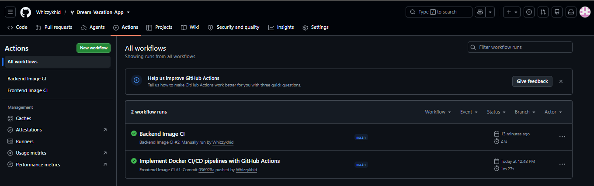
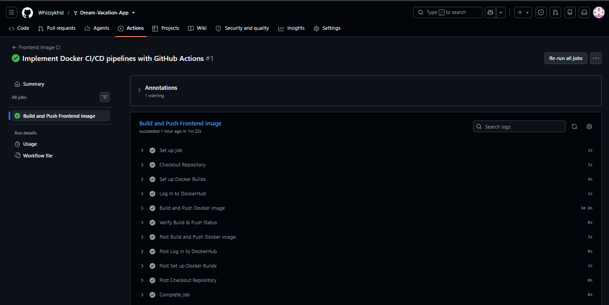
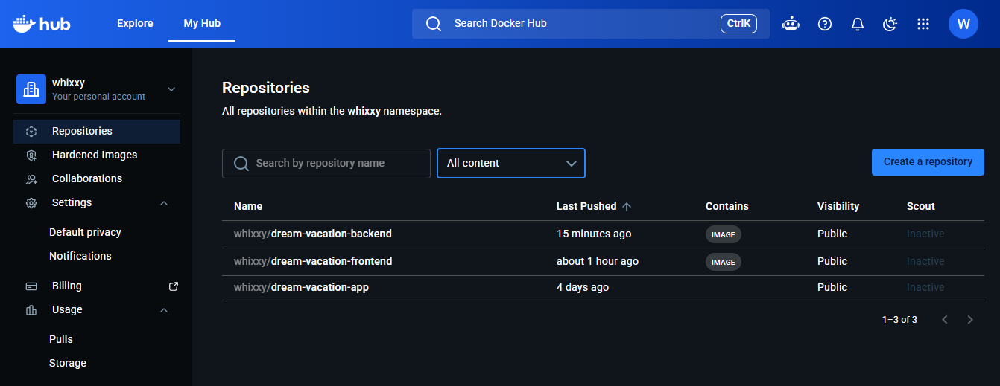
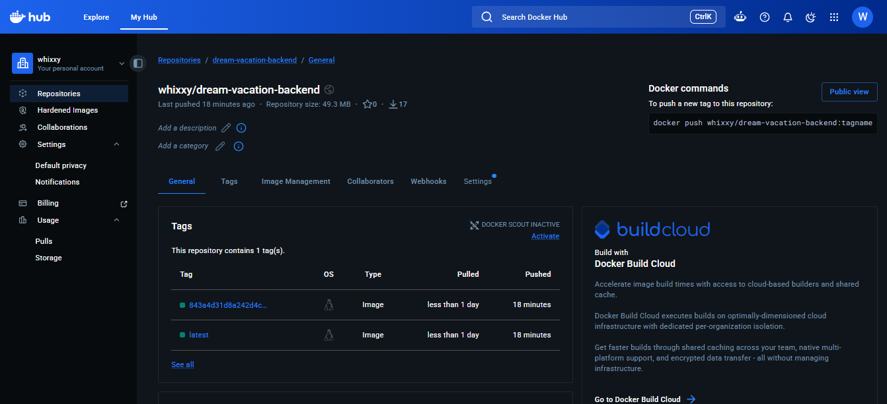
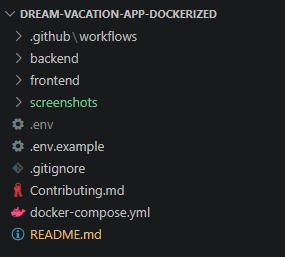
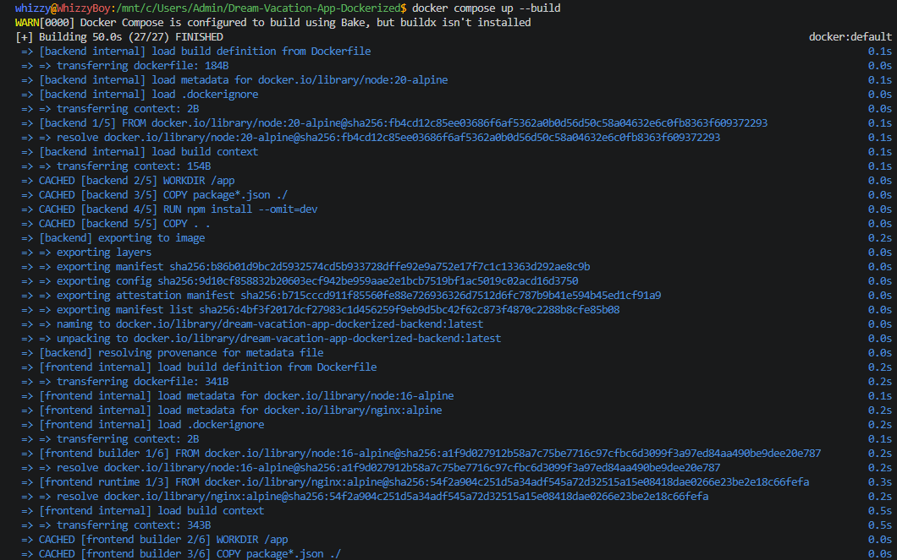
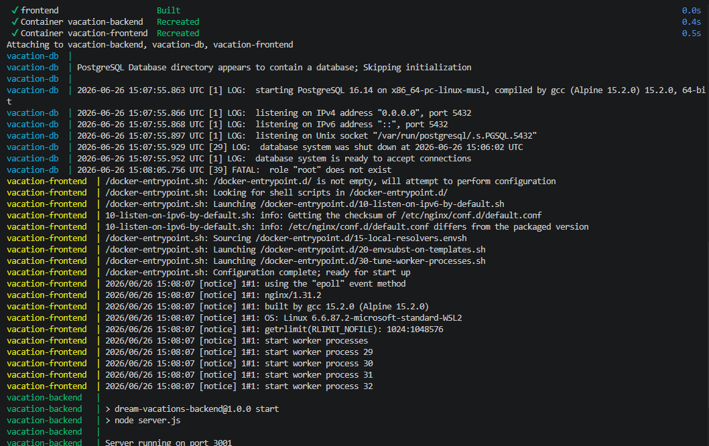
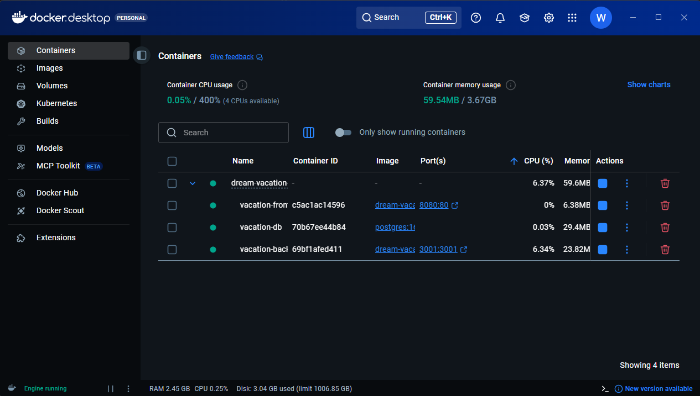
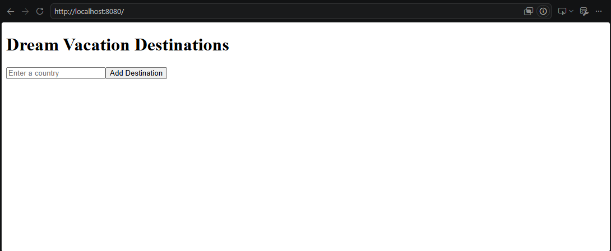

# Dream Vacation Destinations

Dream Vacation Destinations is a full-stack web application that allows users to create and manage a personal list of countries they would like to visit. Country information is retrieved from the REST Countries API, while user data is stored in a PostgreSQL database.

The project was further enhanced by containerizing the application with Docker, orchestrating the services with Docker Compose, and implementing a CI/CD pipeline using GitHub Actions and Docker Hub.

---

## Features

- Add countries to a personal dream vacation list.
- View country details including capital, region and population.
- Remove countries from the list.
- Persistent data storage with PostgreSQL.
- Multi-container deployment using Docker Compose.
- Automated Docker image builds and publishing with GitHub Actions.

---

## Technologies Used

| Component | Technology |
|----------|------------|
| Frontend | React |
| Backend | Node.js & Express |
| Database | PostgreSQL |
| Reverse Proxy | Nginx |
| Containerization | Docker |
| Orchestration | Docker Compose |
| CI/CD | GitHub Actions |
| Container Registry | Docker Hub |

---

## Project Structure

```text
.
├── frontend/
├── backend/
├── .github/
│   └── workflows/
│       ├── frontend.yml
│       └── backend.yml
├── docker-compose.yml
├── README.md
└── screenshots/
```

---

## Project Enhancements

The following improvements were made to the original project:

- Created Dockerfiles for the frontend and backend services.
- Configured a multi-container application using Docker Compose.
- Added a PostgreSQL database service with persistent storage.
- Configured Nginx to serve the React frontend.
- Connected the frontend, backend and database through Docker networking.
- Implemented GitHub Actions workflows for the frontend and backend.
- Configured GitHub Secrets for secure authentication.
- Published Docker images automatically to Docker Hub.
- Tagged Docker images using both `latest` and the Git commit SHA.

> **Note:** The backend application logic (`server.js`) was provided as part of the original project and was not modified.

---

## Running the Project

Clone the repository:

```bash
git clone <repository-url>
cd <repository-name>
```

Build and start all services:

```bash
docker compose up --build
```

To stop the application:

```bash
docker compose down
```

Once the containers are running:

| Service | URL |
|---------|-----|
| Frontend | http://localhost:8080 |
| Backend API | http://localhost:3001 |

---

## Environment Variables

Before starting the application, create the required `.env` file(s) using the provided `.env.example` file(s).

Example variables:

```env
DATABASE_URL=
PORT=
COUNTRIES_API_BASE_URL=
```

Sensitive information such as Docker Hub credentials is stored using GitHub Secrets and is not committed to this repository.

---

## CI/CD STRUCTURE

```text
Code Push
    │
    ▼
GitHub Actions
    │
    ▼
Build Docker Image
    │
    ▼
Login to Docker Hub
    │
    ▼
Push Docker Image
```

## CI/CD Workflows

This project uses GitHub Actions to automate the process of building and publishing Docker images.

The pipeline works as follows:

1. A push or pull request is made to the configured branch.
2. GitHub Actions automatically starts the appropriate workflow.
3. The repository is checked out.
4. Docker Buildx is set up to build the Docker image.
5. The workflow logs in to Docker Hub using credentials stored in GitHub Secrets.
6. The Docker image is built from the corresponding Dockerfile.
7. The image is tagged using both `latest` and the Git commit SHA.
8. The image is pushed automatically to Docker Hub.

This process ensures that every successful change results in an up-to-date Docker image without requiring manual builds or uploads.
---
...
> **Security Note**
>
> The CI/CD pipeline authenticates with Docker Hub using GitHub Secrets (`DOCKER_USERNAME` and `DOCKER_TOKEN`). No passwords, access tokens, or other sensitive credentials are committed to source control.

## Screenshots

### CI/CD Workflows 





---


### Docker Hub Repositories






---

## Other Screenshots

### Project Structure



---

### Docker Compose Build



---

### Docker Compose Run



---

### Running Containers



---

### Application Running



---

## Summary

This project demonstrates:

- Docker containerization of a full-stack application.
- Multi-container orchestration using Docker Compose.
- Automated Docker image builds with GitHub Actions.
- Secure authentication using GitHub Secrets.
- Continuous delivery of Docker images to Docker Hub.