# 🌍 Dream Vacation Destinations

A production-ready, containerized full-stack web application that allows users to create and manage a personal list of dream travel destinations.

This project demonstrates modern DevOps practices by combining **Docker**, **Docker Compose**, **GitHub Actions**, **Terraform**, **AWS**, and **CloudWatch** into a fully automated deployment pipeline.

Instead of manually provisioning infrastructure or deploying applications, the entire workflow—from infrastructure creation to application deployment—is automated using Infrastructure as Code (IaC) and Continuous Integration/Continuous Deployment (CI/CD).

---

# 📌 Features

- Full-stack React and Node.js application
- Dockerized frontend, backend and PostgreSQL services
- Reverse proxy using Nginx
- Infrastructure provisioned using Terraform
- Custom AWS networking (VPC, Subnet, Internet Gateway and Route Table)
- EC2 provisioning with automated bootstrapping using User Data
- Remote Terraform state stored in Amazon S3
- State locking using DynamoDB
- Automated Docker image builds with GitHub Actions
- Docker images published to Docker Hub
- Automated deployment to AWS EC2
- Infrastructure monitoring using Amazon CloudWatch
- Secure credential management with GitHub Secrets

---

# Technology Stack

| Layer | Technology |
|---------|------------|
| Frontend | React |
| Backend | Node.js + Express |
| Database | PostgreSQL |
| Reverse Proxy | Nginx |
| Containerization | Docker |
| Container Orchestration | Docker Compose |
| Infrastructure as Code | Terraform |
| CI/CD | GitHub Actions |
| Container Registry | Docker Hub |
| Cloud Platform | AWS |
| Compute | Amazon EC2 |
| Networking | Amazon VPC |
| Monitoring | Amazon CloudWatch |
| Remote State | Amazon S3 + DynamoDB |

---

# Architecture Overview

The application follows a modern DevOps workflow that combines Infrastructure as Code, containerization, continuous integration, and automated deployment.

The deployment process is as follows:

1. The developer pushes code to GitHub.
2. GitHub Actions automatically builds the frontend and backend Docker images.
3. The images are published to Docker Hub.
4. Terraform provisions or updates the AWS infrastructure.
5. The deployment workflow securely connects to the EC2 instance over SSH.
6. Docker Compose pulls the latest images from Docker Hub and starts the application.
7. Amazon CloudWatch monitors the EC2 instance for CPU utilization and other metrics.

> **Note:** An architecture diagram will be added in a future revision of this project.
---

# 📁 Project Structure


---

# ☁️ Infrastructure as Code (Terraform)

Terraform was used to provision and manage the application's AWS infrastructure using reusable modules.

Infrastructure created includes:

- Custom VPC
- Public Subnet
- Internet Gateway
- Route Table
- Security Group
- EC2 Instance
- CloudWatch Alarm
- Remote State Backend (Amazon S3)
- State Locking (DynamoDB)

---

## Terraform Workflow

Terraform validates, plans and provisions infrastructure consistently.

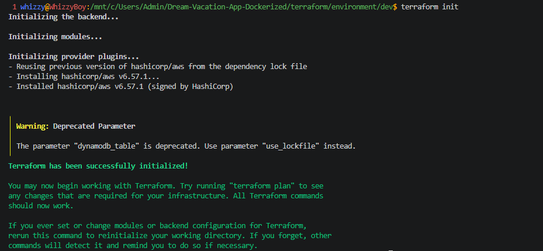

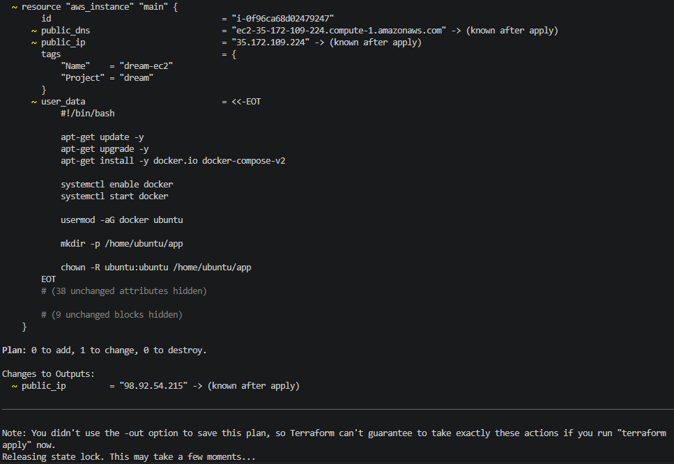

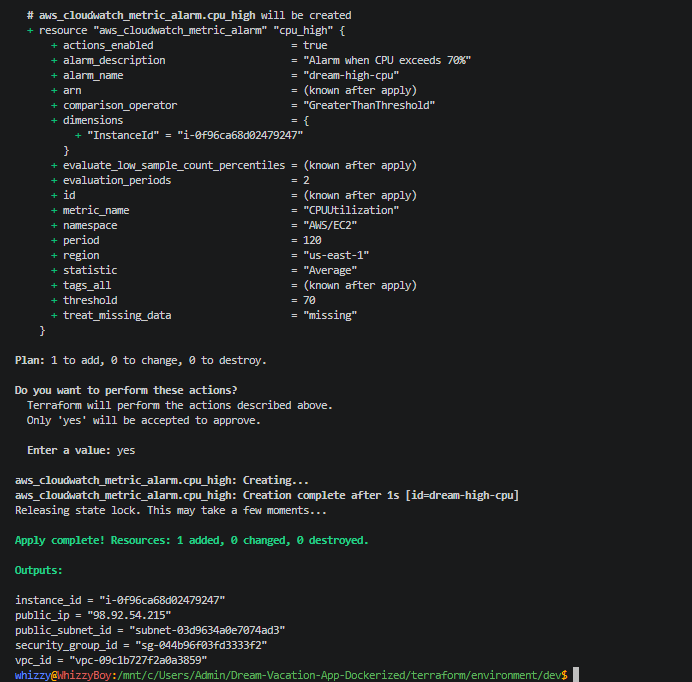

---

## Remote Backend

Terraform state is stored remotely inside an Amazon S3 bucket while DynamoDB provides state locking to prevent concurrent modifications.

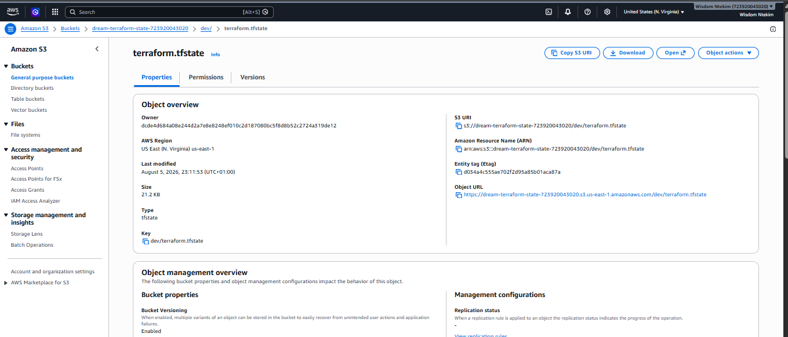

---


## AWS Infrastructure

### Virtual Private Cloud

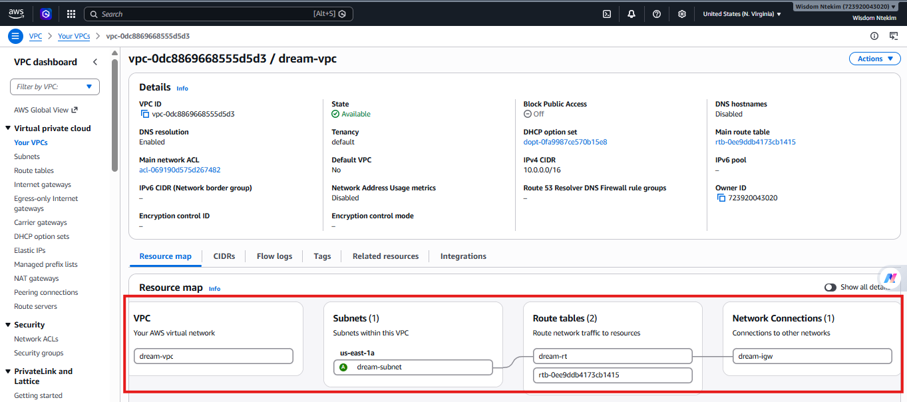

### Public Subnet

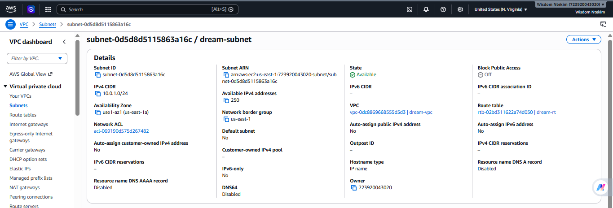

### Security Group

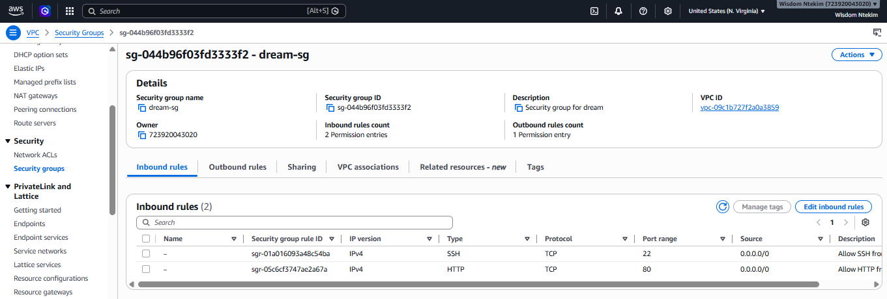

### EC2 Instance

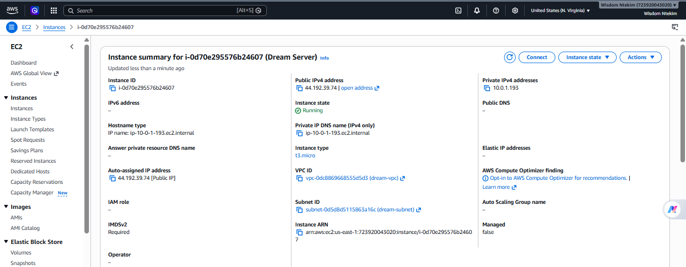

---

# 🚀 EC2 Provisioning

The EC2 instance is automatically configured using a User Data script during provisioning.

The bootstrap script performs the following tasks automatically:

- Updates system packages
- Installs Docker
- Installs Docker Compose
- Starts Docker
- Enables Docker on boot
- Adds the Ubuntu user to the Docker group

### User Data Script

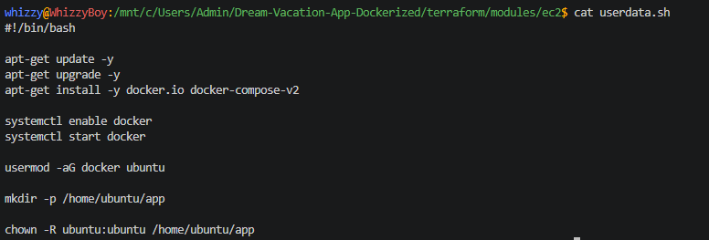

### Bootstrap Verification

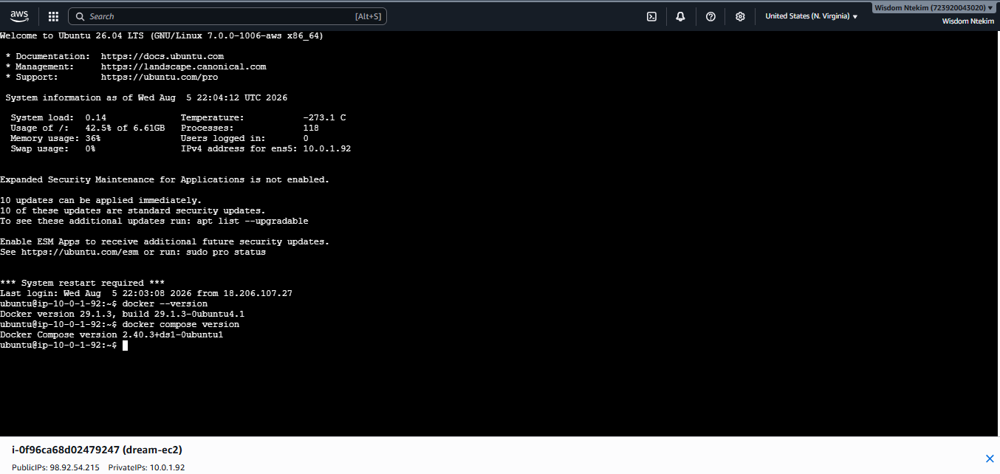

### Running Containers

                                                                                                                           

---

# 🔄 Continuous Integration & Continuous Deployment

This project uses GitHub Actions to automate both infrastructure provisioning and application deployment.

The workflow performs the following operations:

1. Checkout source code
2. Build frontend Docker image
3. Build backend Docker image
4. Push Docker images to Docker Hub
5. Provision AWS infrastructure using Terraform
6. Connect to EC2 over SSH
7. Copy deployment files
8. Pull the latest Docker images
9. Deploy the application using Docker Compose

# 📊 Monitoring

Amazon CloudWatch monitors the EC2 instance after deployment.

Monitoring includes:

- CPU Utilization
- CloudWatch Alarm
- EC2 Metrics

### CPU Metrics

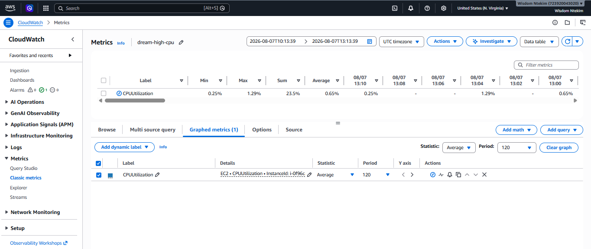

### EC2 Metrics

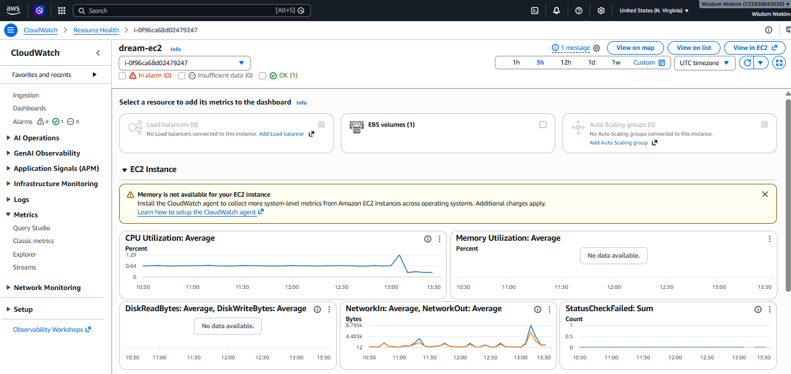

### CPU Alarm

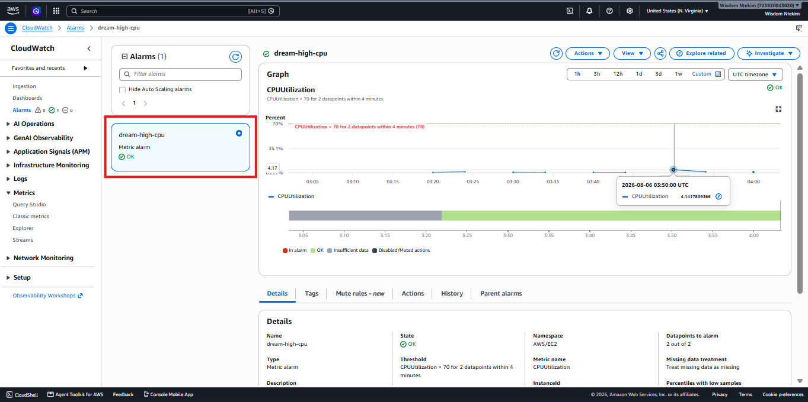

---

# 🔐 Terraform State Management

Terraform remote state is protected using DynamoDB state locking.

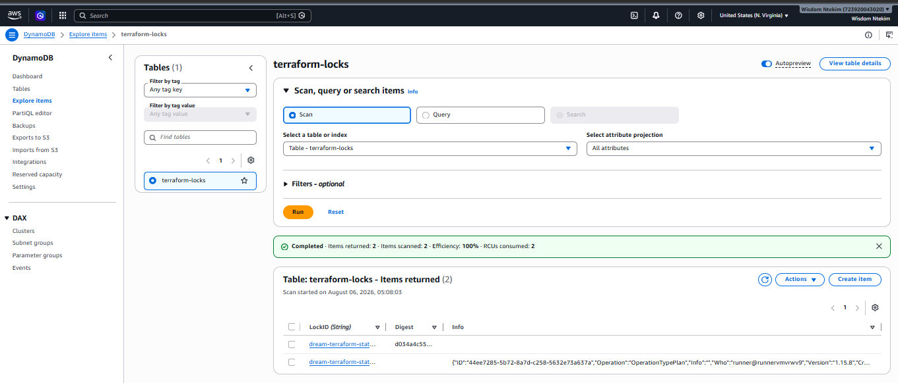

---

### Successful Workflow

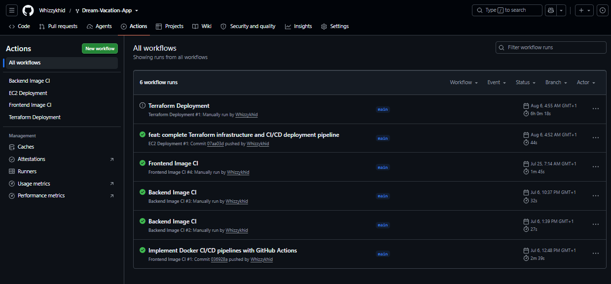

### Deployment Logs

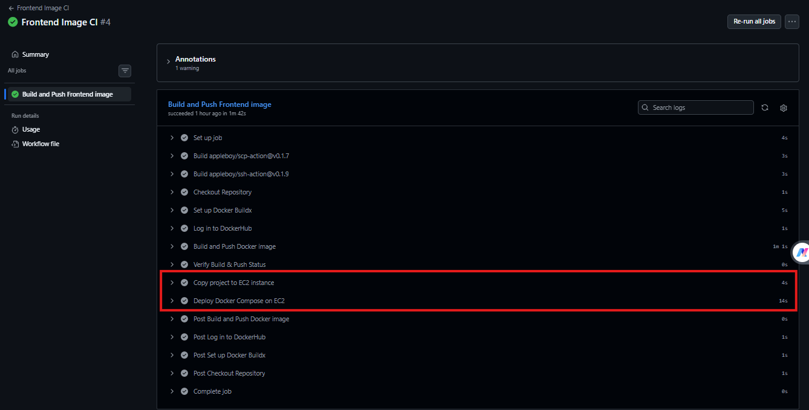

---

# 🐳 Docker Hub

Both frontend and backend images are automatically published to Docker Hub.

### Published Images


### Image Tags


---

# 🌐 Live Application

The application is deployed to an AWS EC2 instance.

| Service | URL |
|---------|-----|
| Frontend | http://44.192.39.74:8080 |
| Backend API | http://44.192.39.74:3001/api/destinations |

### Application

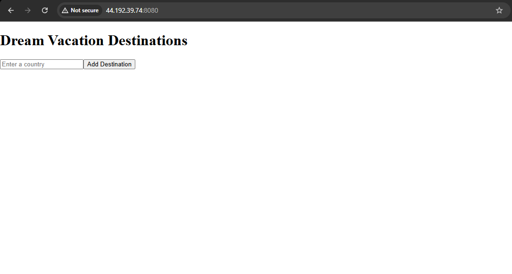

### Running Containers


---

# 💻 Running Locally

Clone the repository.

```bash
git clone https://github.com/<username>/<repo>.git
cd <repo>
```

Build and start the application.

```bash
docker compose up --build
```

Stop the application.

```bash
docker compose down
```

---

# 🔑 Environment Variables

Create the required `.env` files before running the project.

Example:

```env
DATABASE_URL=
PORT=
COUNTRIES_API_BASE_URL=
```

Sensitive credentials including Docker Hub credentials, AWS credentials, EC2 SSH keys and deployment secrets are securely stored using **GitHub Secrets** and are never committed to the repository.

---

# 📸 Project Gallery

This project demonstrates:

- Infrastructure as Code using Terraform
- Containerization using Docker
- Multi-container orchestration with Docker Compose
- CI/CD automation using GitHub Actions
- Automated AWS EC2 deployment
- CloudWatch monitoring
- Remote Terraform state with Amazon S3
- State locking with DynamoDB
