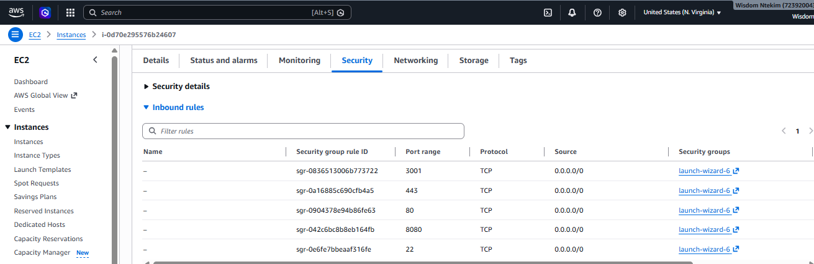
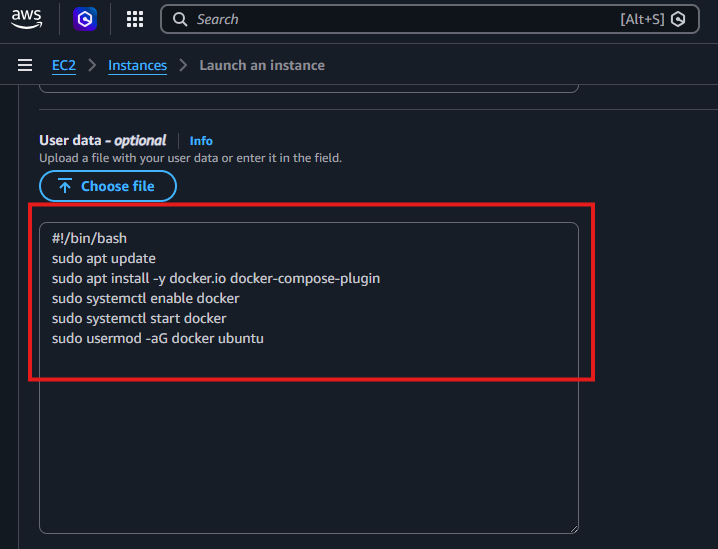
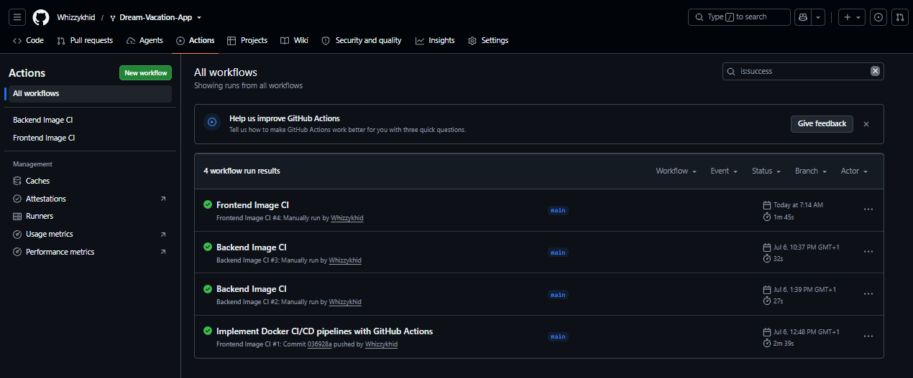
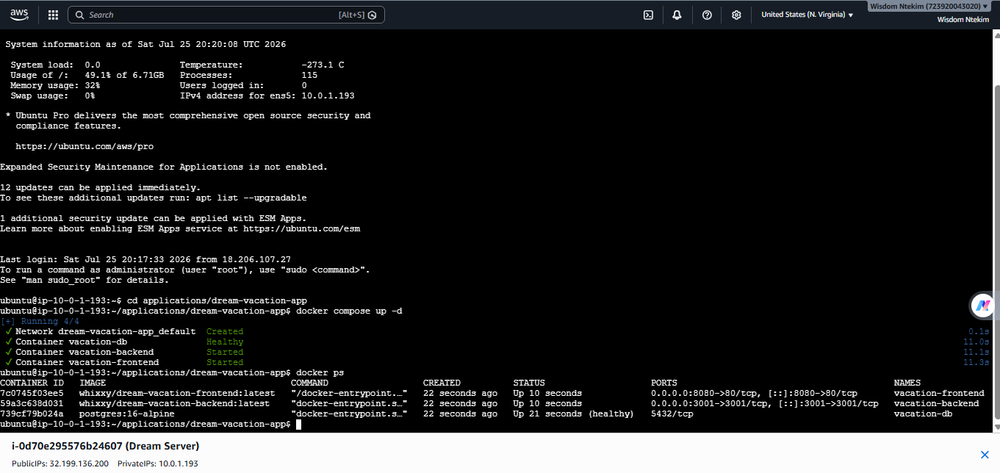

# Dream Vacation Destinations

Dream Vacation Destinations is a full-stack web application that allows users to create and manage a personal list of countries they would like to visit. Country information is retrieved from the REST Countries API, while user data is stored in a PostgreSQL database.

The project was further enhanced by containerizing the application with Docker, orchestrating the services with Docker Compose, implementing CI/CD pipeline using GitHub Actions, publishing images to Docker Hub and automatically deploying the application to an AWS EC2 instance

---

## Features

- Add countries to a personal dream vacation list.
- View country details including capital, region and population.
- Remove countries from the list.
- Persistent data storage with PostgreSQL.
- Multi-container deployment using Docker Compose.
- Automated Docker image builds and publishing.
- Automated Deployment to AWS EC2.

---

## Technologies Used

| Component | Technology |
|----------|------------|
| Frontend | React |
| Backend | Node.js & Express |
| Database | PostgreSQL |
| Reverse Proxy | Nginx |
| Containerization | Docker |
| Orchestration | Docker Compose |
| CI/CD | GitHub Actions |
| Container Registry | Docker Hub |
| Cloud Platform | AWS EC2 |
| Networking | AWS VPC |

---

## Project Structure

```text
.
├── frontend/
├── backend/
├── .github/
│   └── workflows/
│       ├── frontend.yml
│       └── backend.yml
├── docker-compose.yml
├── README.md
└── screenshots/
```

---

## Project Enhancements

The following improvements were made:

- Containerized the frontend and backend using Docker.
- Configured a multi-container application with Docker Compose.
- Added PostgreSQL with persistent Docker volumes.
- Configured Nginx to serve the frontend.
- Connected all services through Docker networking.
- Created separate GitHub Actions workflows for the frontend and backend.
- Configured GitHub Secrets for secure credential management.
- Automatically built and published Docker images to Docker Hub.
- Tagged Docker images using both `latest` and the Git commit SHA.
- Provisioned AWS infrastructure consisting of:
  - Virtual Private Cloud (VPC)
  - Public Subnet
  - Internet Gateway
  - Route Table
  - EC2 Instance
- Extended the pipeline to automatically deploy the latest application version to AWS EC2 using SSH and Docker Compose.

> **Note:** The backend application logic (`server.js`) was provided as part of the original project and was not modified.

---

## Live Deployment

| Service | URL |
|---------|-----|
| Frontend | http://44.192.39.74:8080 |
| Backend API | http://44.192.39.74:3001/api/destinations |

> **Note:** The application is hosted on an AWS EC2 instance. If the links are unavailable, the instance may have been stopped or terminated after submission.

## Running Locally

Clone the repository:

```bash
git clone <repository-url>
cd <repository-name>
```

Start the application:

```bash
docker compose up --build
```

Stop the application:

```bash
docker compose down
```

Once the containers are running:

| Service | URL |
|---------|-----|
| Frontend | http://localhost:8080 |
| Backend API | http://localhost:3001 |

---

## Deployment Pipeline

This project uses GitHub Actions to automate the entire deployment process. Whenever changes are pushed to the configured branch, the workflow runs automatically, reducing the need for manual deployment.

### 1. Checkout the Repository
The workflow begins by checking out the latest version of the source code from the GitHub repository.

### 2. Build Docker Images
Docker Buildx is set up, after which the frontend and backend images are built using their respective Dockerfiles.

### 3. Authenticate with Docker Hub
GitHub Actions securely logs in to Docker Hub using credentials stored as GitHub Secrets, ensuring that sensitive information is never exposed in the repository.

### 4. Push Docker Images
Once the images are built successfully, they are tagged with both `latest` and the current Git commit SHA before being pushed to Docker Hub.

### 5. Deploy to AWS EC2
After publishing the images, the workflow connects to the EC2 instance over SSH. The latest project files, including the `docker-compose.yml` file, are copied to the server, and the required environment variables are generated from GitHub Secrets.

The workflow then pulls the latest Docker images from Docker Hub and restarts the application using Docker Compose.

### 6. Application Update
Once the deployment is complete, the updated containers are running on the EC2 instance, making the latest version of the application available without requiring any manual intervention.


## Environment Variables

Before starting the application, create the required `.env` file(s) using the provided `.env.example` file(s).

Example variables:

```env
DATABASE_URL=
PORT=
COUNTRIES_API_BASE_URL=
```

Sensitive information including:

- Docker Hub credentials
- SSH private key
- EC2 host details
- Application environment variables

are securely stored using **GitHub Secrets** and are never committed to this repository.

---

# Screenshots

## AWS Infrastructure

### Virtual Private Cloud (VPC)


---

### Public Subnet


---

### EC2 Instance


---

### Security Group



---

## EC2 Bootstrap (User Data)

The EC2 instance was bootstrapped using EC2 User Data to automate:

- Docker installation
- Docker Compose installation
- Docker service startup
- Docker service enablement
- Docker group configuration



---

## Live Application

### Running Application


---

## GitHub Actions

### Successful Workflow



---

### Deployment Logs


---

## Docker Hub

### Docker Images


---

### Image Tags


---

## Deployment Verification

### Server Containers



---

### Local Containers


---

### Docker Compose


---

## Summary

This project demonstrates:

- Docker containerization of a full-stack application.
- Multi-container orchestration using Docker Compose.
- Automated Docker image builds with GitHub Actions.
- Secure secret management using GitHub Secrets.
- Docker image publishing to Docker Hub.
- Automated deployment to AWS EC2 using SSH.
- Continuous delivery using Docker Compose.
- AWS networking using a custom VPC, public subnet, Internet Gateway, and Route Table.
