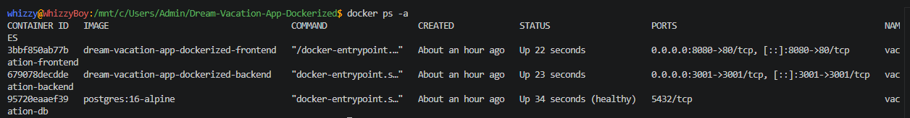
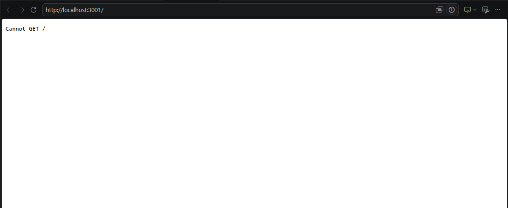

# Dream Vacation Destinations

Dream Vacation Destinations is a full-stack web application that allows users to create and manage a personal list of countries they would like to visit. Country information is retrieved from the REST Countries API, while user data is stored in a PostgreSQL database.

The project was further enhanced by containerizing the application with Docker, orchestrating the services with Docker Compose, and implementing a CI/CD pipeline using GitHub Actions and Docker Hub.

---

## Features

- Add countries to a personal dream vacation list.
- View country details including capital, region and population.
- Remove countries from the list.
- Persistent data storage with PostgreSQL.
- Multi-container deployment using Docker Compose.
- Automated Docker image builds and publishing with GitHub Actions.

---

## Technologies Used

| Component | Technology |
|----------|------------|
| Frontend | React |
| Backend | Node.js & Express |
| Database | PostgreSQL |
| Reverse Proxy | Nginx |
| Containerization | Docker |
| Orchestration | Docker Compose |
| CI/CD | GitHub Actions |
| Container Registry | Docker Hub |

---

## Project Structure

```text
.
├── frontend/
├── backend/
├── .github/
│   └── workflows/
│       ├── frontend.yml
│       └── backend.yml
├── docker-compose.yml
├── README.md
└── screenshots/
```

---

## Architecture

```text
Browser
   │
   ▼
Nginx (Frontend)
   │
   ▼
Express Backend
   │
   ▼
PostgreSQL
```

---

## Project Enhancements

The following improvements were made to the original project:

- Created Dockerfiles for the frontend and backend services.
- Configured a multi-container application using Docker Compose.
- Added a PostgreSQL database service with persistent storage.
- Configured Nginx to serve the React frontend.
- Connected the frontend, backend and database through Docker networking.
- Implemented GitHub Actions workflows for the frontend and backend.
- Configured GitHub Secrets for secure authentication.
- Published Docker images automatically to Docker Hub.
- Tagged Docker images using both `latest` and the Git commit SHA.

> **Note:** The backend application logic (`server.js`) was provided as part of the original project and was not modified.

---

## Running the Project

Clone the repository:

```bash
git clone <repository-url>
cd <repository-name>
```

Build and start all services:

```bash
docker compose up --build
```

To stop the application:

```bash
docker compose down
```

Once the containers are running:

| Service | URL |
|---------|-----|
| Frontend | http://localhost:8080 |
| Backend API | http://localhost:3001 |

---

## Environment Variables

Before starting the application, create the required `.env` file(s) using the provided `.env.example` file(s).

Example variables:

```env
DATABASE_URL=
PORT=
COUNTRIES_API_BASE_URL=
```

Sensitive information such as Docker Hub credentials is stored using GitHub Secrets and is not committed to this repository.

---

## CI/CD

GitHub Actions automates the build and publishing process for both the frontend and backend Docker images.

Each workflow:

- Runs on pushes and pull requests to the configured branches.
- Builds the Docker image using Docker Buildx.
- Authenticates with Docker Hub using GitHub Secrets.
- Pushes the image to Docker Hub.
- Tags images using both `latest` and the Git commit SHA.

---

## Screenshots

### Project Structure


---

### Docker Compose Build


---

### Running Containers



---

### GitHub Actions


---

### Docker Hub Repository


---

### Application Running


---

### Backend Running



---

## Summary

This project demonstrates:

- Docker containerization of a full-stack application.
- Multi-container orchestration using Docker Compose.
- Automated Docker image builds with GitHub Actions.
- Secure authentication using GitHub Secrets.
- Continuous delivery of Docker images to Docker Hub.